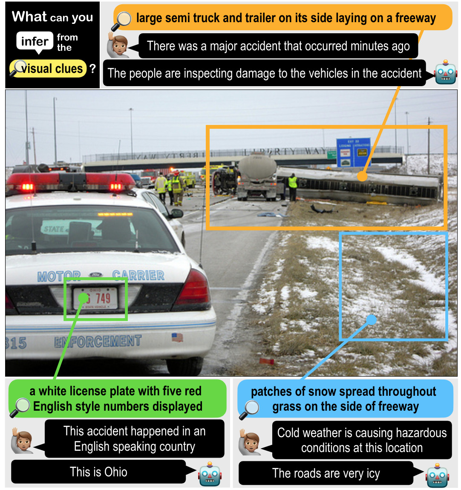

# Sherlock

This repo contains code, data, and models for the Sherlock
corpus. If you find the [paper](https://arxiv.org/abs/2202.04800), corpus, and models interesting or helpful
for your own work, please consider citing:

```
@article{hesselhwang2022abduction,
  title={{The Abduction of Sherlock Holmes: A Dataset for Visual Abductive Reasoning}},
  author={*Hessel, Jack and *Hwang, Jena D and Park, Jae Sung and Zellers, Rowan and Bhagavatula, Chandra and Rohrbach, Anna and Saenko, Kate and Choi, Yejin},
  journal={arXiv preprint arXiv:2202.04800},
  year={2022}
}
```

## Dataset Download

- Sherlock training corpus v1.1 [download](https://storage.googleapis.com/ai2-mosaic-public/projects/sherlock/data/sherlock_train_v1_1.json.zip)
- Sherlock validation corpus v1.1 [download](https://storage.googleapis.com/ai2-mosaic-public/projects/sherlock/data/sherlock_val_with_split_idxs_v1_1.json.zip)

We do not publicly release the test set labels, but do have a
[leaderboard](https://leaderboard.allenai.org/sherlock/). See the [leaderboard section](https://github.com/allenai/sherlock/tree/main/leaderboard_eval)
for more detail. In our experience, results on the validation/test sets are quite similar.


## What is Sherlock?

We collected a large corpus of *abductive inferences* over
images. Abductive reasoning is the act of reasoning about plausible
inferences in the case of uncertainty. Our corpus consists of 363K
inferences across 103K images. Each inference is grounded in images
via a bounding box. Our model predicts an abductive inference given
an image and a bounding box. Example predictions of one of our
best best performing models, alongside the human annotations,
is given here:

<p align="center">
  
</p>


## Images Download

The images for Sherlock are sourced from
[VisualGenome](https://visualgenome.org/api/v0/api_home.html) and
[VCR](https://visualcommonsense.com/download/): if you find the
sherlock corpus useful, please cite those works as well! To train a
new model or get predictions on the validation/test sets, you will
have to download these images locally. *Please do not download the
images from the URLs contained in the data we release,* instead, use:

- [VCR Images Download](https://visualcommonsense.com/download/)
- [VisualGenome Images Download](https://visualgenome.org/api/v0/api_home.html)


In addition, we release:

- Sherlock auto bounding box proposals for val/train/test
[download](https://storage.googleapis.com/ai2-mosaic-public/projects/sherlock/data/image_url2auto_bboxes.json.zip). These
are bounding box proposals from a pretrained Faster-RCNN model with a
ResNeXt101 backbone.

## Code

We release several pieces of code:

- `training_code` contains the scripts we used to train the CLIP-style models from the paper.
- `demo` contains an jupyter notebook that you can use to explore the predictions of a pretrained model
- `leaderboard_eval` contains the official evaluation scripts, alongside leaderboard submission details.

## Pretrained models

We release four pretrained versions of
[CLIP](https://arxiv.org/abs/2103.00020), fit to the Sherlock
corpus. As detailed in the paper, the model is trained using InfoNCE,
and augmented to incorporate bounding boxes as input via the bounding
box being drawn on the image in pixel space directly. The most performant
model is `RN50x64-multitask`; the fastest model is `ViT/B-16`.

The checkpoints we release are:

- `ViT/B-16` [571M download](https://storage.googleapis.com/ai2-mosaic-public/projects/sherlock/pretrained_models/model%3DViT-B16~batch%3D512~warmup%3D500~lr%3D1e-05~valloss%3D0.0000~highlightbbox~widescreen_STEP%3D1800.pt)
- `RN50x16` [1.1G download](https://storage.googleapis.com/ai2-mosaic-public/projects/sherlock/pretrained_models/model%3DRN50x16~batch%3D200~warmup%3D500~lr%3D1e-05~valloss%3D0.0000~highlightbbox~widescreen_STEP%3D4500.pt)
- `RN50x64` [2.3G download](https://storage.googleapis.com/ai2-mosaic-public/projects/sherlock/pretrained_models/model%3DRN50x64~batch%3D64~warmup%3D1000~lr%3D1e-05~valloss%3D0.0000~highlightbbox~widescreen_STEP%3D15600.pt)
- `RN50x64-multitask` [2.3G download](https://storage.googleapis.com/ai2-mosaic-public/projects/sherlock/pretrained_models/model%3DRN50x64~batch%3D64~warmup%3D1000~lr%3D1e-05~valloss%3D0.0000~randomclueinfhighlightbbox~widescreen_STEP%3D25200.pt)

See the demo jupyter notebook for usage, and the leaderboard
evaluation code for official evaluation code.

## Older version of the dataset

Currently, the Sherlock corpus is in verison 1.1. Verison 1.0 of the
train/validation sets can be downloaded here. The models in the paper
are trained mostly on the v1 corpora, but we observe very little
difference in practice. We recommend using version 1.1 for all cases,
unless you are specifically interested in exactly replicating the
corpora the model checkpoints were trained on.

- Sherlock training corpus v1 (depricated) [download](https://storage.googleapis.com/ai2-mosaic-public/projects/sherlock/data/sherlock_train_v1.json.zip)
- Sherlock validation corpus v1 (depricated) [download](https://storage.googleapis.com/ai2-mosaic-public/projects/sherlock/data/sherlock_val_with_split_idxs_v1.json.zip)


## License

Sherlock (codebase) is licensed under the Apache License 2.0 (see CODE_LICENSE).
Sherlock (dataset) is licensed under CC-BY (see DATASET_LICENSE).


