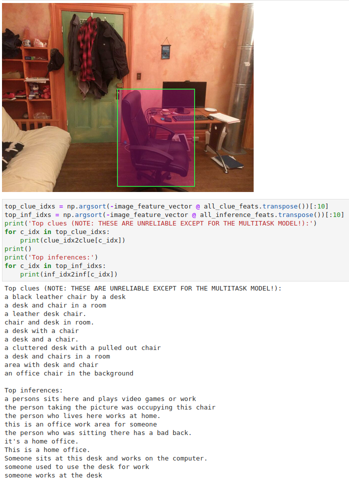

## What's in here?

This folder contains a self-contained [demo](https://github.com/allenai/sherlock/blob/main/demo/sherlock_demo.ipynb) for running pre-trained Sherlock models in inference mode. You can use it to produce predictions like this:

  

