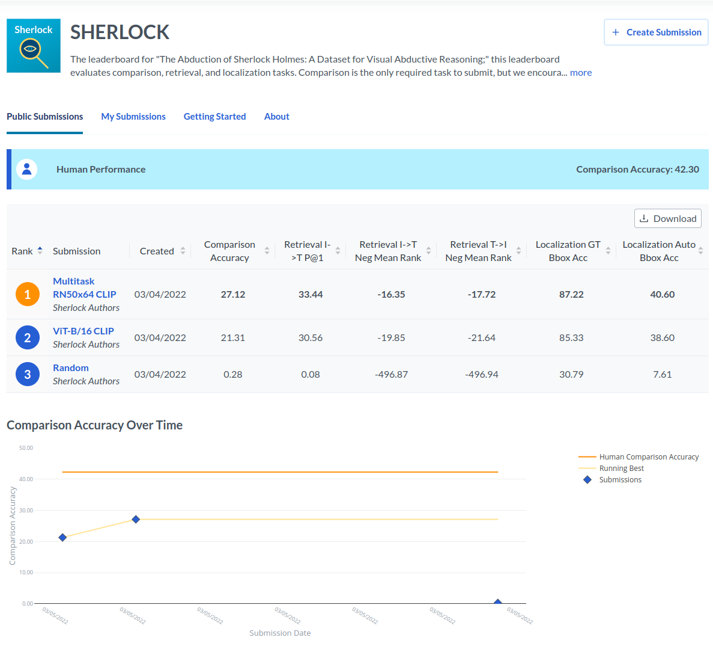

## What's in here?

This directory contains three things:

1. Leaderboard-formatted data for you to make predictions on if you want to make a leaderboard submission.
2. Example scripts that show-off a leaderboard submission of the CLIP-backbone models from the original paper.
3. The evaluation scripts the leaderboard uses to produce the official metrics.

[The sherlock leaderboard is hosted here](https://leaderboard.allenai.org/sherlock)!

<p align="center">
  
</p>


## Downloads:

1. leaderboard format validation instances/labels [retrieval](https://storage.googleapis.com/ai2-mosaic-public/projects/sherlock/leaderboard_data/val_retrieval.zip), [localization](https://storage.googleapis.com/ai2-mosaic-public/projects/sherlock/leaderboard_data/val_localization.zip), [comparison](https://storage.googleapis.com/ai2-mosaic-public/projects/sherlock/leaderboard_data/val_comparison.zip)
2. leaderboard format test instances [retrieval](https://storage.googleapis.com/ai2-mosaic-public/projects/sherlock/leaderboard_data/test_retrieval_public.zip), [localization](https://storage.googleapis.com/ai2-mosaic-public/projects/sherlock/leaderboard_data/test_localization_public.zip), [comparison](https://storage.googleapis.com/ai2-mosaic-public/projects/sherlock/leaderboard_data/test_comparison_public.zip)

## What is the leaderboard data format?

For all tasks, we distribute jsons of the form:

```
[ ...

{
    "image": {
      "url": "https://cs.stanford.edu/people/rak248/VG_100K/2371713.jpg",
      "width": 500,
      "height": 333
    },
    "region": [
      {
        "height": 86,
        "width": 170,
        "left": 201,
        "top": 154
      }
    ],
    "inference": "this is a preferred posture",
    "test_id": "15cffa7518035ba4bda661d534660395",
    "extra_info": {
      "task": "comparison"
    }
  },
  ...
```

To submit the leaderboard and/or get official evaluation metrics, your
model needs to assign a score to all (image, region, inference)
triples in the given jsons. The output format is a single numpy array,
containing a single score for each instance in the input file. Say
that, somewhere in your code, you have constructed a dictionary that
maps from test ids scores, e.g., if your
model estimates a similarity of .613 for the example above:
```
my_model_predictions = {
  ...
  "15cffa7518035ba4bda661d534660395": .613,
  ...
}
```
To get a single numpy array to submit, you will order the scores according
to their sorted keys, i.e.,
```
sorted_scores = np.array(
    [my_model_predictions[k]
     for k in sorted(my_model_predictions.keys())]
     ).astype(np.float32)
np.save('comparison.npy', sorted_scores)
```

#### Submission format

Your submission will be a single `.zip` file named
`test_set_submission.zip`.  This `zip` must contain, at a minimum,
`comparison.npy`, holding the per-instance comparison predictions:

```
test_set_submission/
└── comparison.npy
```

You are also welcome to submit to the localization/retrieval tasks.
For localization, you can augment with `localization.npy`:

```
test_set_submission/
├── comparison.npy
└── localization.npy
```

For retrieval, you must submit predictions for all 22 splits, which
will form:

```
test_set_submission/
├── comparison.npy
├── localization.npy
├── retrieval_0.npy
├── retrieval_1.npy
...
├── retrieval_21.npy
└── retrieval_22.npy
```

You can validate that your submission will be processed correctly
by running `validate_submission.py test_set_submission.zip`.


#### Important note about efficiency

The submission jsons for retrieval and localization can be /quite
large/! For example, to compute retrieval predictions, we require
models to produce scores for all possible pairs of 1000 (image,
region) x 1000 inference pairs, which totals 1M!

Depending on the format of your model, instead of simply scoring each
(image, region, inference) independently, it may be possible to
cache/reuse a lot of the computation. For example, for the CLIP models
we propose in the paper, we encode images/texts independently. So
instead of doing 1000*1000 = 1M forward passes, we can do 1000 image
encodings, 1000 text encodings, and then take a parwise similarity
score between all pairs via cosine similarity. If your model is
bidirectional, e.g., the UNITER baseline in the paper, you may need to
produce 1M forward passes. But certain bidirectional models may be
more efficient, e.g., for localization.

## Scoring scripts

The official scoring scripts are `score_comparison.py`,
`score_localization.py`, and `score_retrieval.py`. These are the
scripts that compute the leaderboard metrics after you submit. See
the submission walkthrough below.

## Walkthrough of submission

Included are two scripts that make valid leaderboard submissions: one
makes a random submission, and the other makes submissions for the CLIP
models from the paper. We will briefly walkthrough a submission for
the random predictor.

The first step is to play with the validation set. We can download the
validation data above, and create `validation_set_predictions`

```
dummy_predictor.py
validation_set_predictions
val_comparison
├── val_comparison_answer_key.json
├── val_comparison_instance_ids.json
└── val_comparison_instances.json
val_localization
├── val_localization_answer_key.json
├── val_localization_instance_ids.json
└── val_localization_instances.json
val_retrieval
├── val_retrieval_0_answer_key.json
├── val_retrieval_0_instance_ids.json
├── val_retrieval_0_instances.json
├── val_retrieval_1_answer_key.json
├── val_retrieval_1_instance_ids.json
├── val_retrieval_1_instances.json
...
├── val_retrieval_22_answer_key.json
├── val_retrieval_22_instance_ids.json
└── val_retrieval_22_instances.json
```

Then, we can run our predictor:

```
python dummy_predictor.py val_comparison/val_comparison_instances.json validation_set_predictions/comparison.npy
python dummy_predictor.py val_localization/val_localization_instances.json validation_set_predictions/localization.npy
for i in {0..22}; do echo $i; python dummy_predictor.py val_retrieval/val_retrieval_$i\_instances.json validation_set_predictions/retrieval_$i\.npy; done;
```

Then, we can run our scorers:

```
python score_comparison.py validation_set_predictions/comparison.npy val_comparison/val_comparison_answer_key.json --instance_ids val_comparison/val_comparison_instance_ids.json

> Human corr: 42.28
> Model corr: -2.25 (N=485)
> Random corr: 1.06 (N=485)
> Oracle corr: 88.60 (N=485)

python score_localization.py validation_set_predictions/localization.npy val_localization/val_localization_answer_key.json --instance_ids val_localization/val_localization_instance_ids.json

> acc gt bbox = 30.2214 (n=6656), acc auto bbox = 7.7687 (n=6656), acc oracle bbox = 95.9762 (n=6656)

for i in {0..22}; do echo $i; python score_retrieval.py validation_set_predictions/retrieval_$i\.npy val_retrieval/val_retrieval_$i\_answer_key.json --instance_ids val_retrieval/val_retrieval_$i\_instance_ids.json; done;

> 0
> im2txt: 486.394
> txt2im: 486.752
> p_at_1: 0.102
...

```

If you're happy with your model's performance on val (you probably shouldn't be for the random predictor :-) ), you can then construct the test set submission. First, download the test instances from the links above, then:

```
python dummy_predictor.py test_comparison_public/test_comparison_instances.json test_set_predictions/comparison.npy
python dummy_predictor.py test_localization_public/test_localization_instances.json test_set_predictions/localization.npy
for i in {0..22}; do echo $i; python dummy_predictor.py test_retrieval_public/test_retrieval_$i\_instances.json test_set_predictions/retrieval_$i\.npy; done;
```

Then, you can zip and check your submission:

```
zip -r test_set_predictions.zip test_set_predictions/
python validate_submission.py test_set_submissions.zip
> checking for comparison
> okay!
> checking for localization
> okay!
> checking for retrieval
> okay!
```

This indicates that all three tasks will be evaluated on the test server when `test_set_predictions.zip` is uploaded.

## CLIP model predictions

We include additional example scripts that create more competitive sumissions: our CLIP based models
from the paper. These are in `clip_leaderboard`.

after downloading/unzipping 1) the public instances linked in this readme; 2) the VCR/VG images, run:
```
cd clip_leaderboard
wget https://storage.googleapis.com/ai2-mosaic-public/projects/sherlock/pretrained_models/model%3DRN50x64~batch%3D64~warmup%3D1000~lr%3D1e-05~valloss%3D0.0000~randomclueinfhighlightbbox~widescreen_STEP%3D25200.pt
```

then, modify the paths in the script from the image directory from `/home/jackh/sherlock_images` to
wherever you grabbed the images. Finally, you can run with

```
./run_multitask_test_predictions.sh
```

which will output `test_set_predictions/` and all predictions from our best model.
